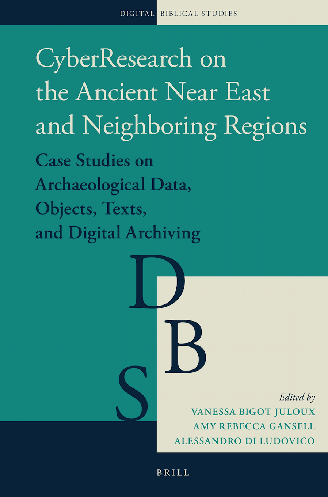

<h2> CyberResearch on the Ancient Near East and Neighboring Regions. Case Studies on Archaeological Data, Objects, Texts, and Digital Archiving</h2>
Vanessa Bigot Juloux, Amy Rebecca Gansell, Alessandro di Ludovico (eds.). Brill, Digital Bible Studies 2. 2018, 460 +  XXVIII.  
&#9758; <a href="#authors">Authors</a> | <a href="#table-content">Table of contents</a> | <a href="#readership">Readership</a>

<h3>Overview</h3>

CyberResearch on the Ancient Near East and Neighboring Regions provides case studies on archaeology, objects, cuneiform texts, and online publishing, digital archiving, and preservation. 
Eleven chapters present a rich array of material, spanning the fifth through the first millennium BCE, from Anatolia, the Levant, Mesopotamia, and Iran. Customized cyber- and general glossaries support readers who lack either a technical background or familiarity with the ancient cultures. Edited by Vanessa Bigot Juloux, Amy Rebecca Gansell, and Alessandro di Ludovico, this volume is dedicated to broadening the understanding and accessibility of digital humanities tools, methodologies, and results to Ancient Near Eastern Studies. Ultimately, this book provides a model for introducing cyber-studies to the mainstream of humanities research.
 
 

 View <a href="https://brill.com/flyer/title/34932?print=pdf" target="_target">PDF Flyer</a>. 
 Order on <a href="https://brill.com/view/title/34932" target="_blank">Brill website</a> (Ebook in open access and hardback).

<h3>Co-editors</h3>
<ul style="list-style-type: none;">
<li>&#8702; <a href="http://vanessajuloux.xyz" target="_blank">Vanessa Bigot Juloux</a> (EPHE-PSL) 
  Vanessa Bigot Juloux is a PhD candidate at the École Pratique des Hautes Etudes and Paris Sciences et Lettres. She has recently developed open-access guidelines for analyzing actions in TEI-XML (<a href="https://zenodo.org/record/1202468" target="_blank">DOI 10.5281/zenodo.1202468</a>) and is currently co-editing a volume on violence in ancient cultures.
  </li>
<li>&#8702; <a href="https://stjohns.academia.edu/AmyRebeccaGansell" target="_blank">Amy Rebecca Gansell</a> (St Johns University) 
  Amy Rebecca Gansell, Ph.D. (2008), Harvard University, is Associate Professor of Art History at St. John’s University (New York). She has published computational and digital research in <em>the American Journal of Archaeology, Cambridge Archaeological Journal, and Journal of Archaeological Science</em>.</li>
<li>&#8702; <a href="https://uniroma1.academia.edu/AlessandroDiLudovico" target="_blank">Alessandro di Ludovico</a> (Sapienza University) 
  Alessandro di Ludovico, Ph.D. (2007), Sapienza University, Rome, is a research fellow in Near Eastern Archaeology at the same university. His research deals with perception and communication in the ancient Near East; he is co-director of “Atlante del Vicino Oriente Antico”.</li>
</ul>

<h3><a name="authors" style="color: black">Authors</a></h3>
_by (surnames) alphabetic order_ 
<ul style="list-style-type: none;">
  <li>&#8702; <a href="http://vanessajuloux.xyz" target="_blank">Vanessa Bigot Juloux</a> (EPHE-PSL)</li>
  <li>&#8702; <a href="https://ephe-sorbonne.academia.edu/DKaanEr" target="_blank">Doğu Kaan Eraslan</a> (EPHE-PSL)</li>
  <li>&#8702; Heidi Jauhiainen (University of Helsinki)</li>
   <li>&#8702; <a href="https://uniroma1.academia.edu/AlessandroDiLudovico" target="_blank">Alessandro di Ludovico</a> (Sapieneza University)</li>
  <li>&#8702; <a href="https://helsinki.academia.edu/KristerLindén" target="_blank">Krister Lindén</a> (University of Helsinki)</li>
  <li>&#8702; <a href="https://independent.academia.edu/MatthewMartino3" target="_blank">Matthew Martino</a></li>
   <li>&#8702; <a href="https://saic.academia.edu/ShannonMartino" target="_blank">Shannon Martino</a> (School of Art University of Chicago)</li>
  <li>&#8702; <a href="https://huji.academia.edu/SvetaMatskevich" target="_blank">Sveta Matskevich</a> (Institute of Archaeology at the Hebrew University, Jerusalem)</li>
  <li>&#8702; <a href="https://ubc.academia.edu/MWillisMonroe" target="_blank">M. Willis Monroe</a> (University of British Columbia)</li>
  <li>&#8702; <a href="https://anu-au.academia.edu/TerhiNurmikkoFuller" target="_blank">Terhi Nurmikko-Fuller</a> (Australian National University)</li>
  <li>&#8702; <a href="https://utoronto.academia.edu/ÉmiliePagéPerron" target="_blank">Émilie Pagé-Perron</a> (University of Toronto)</li>
  <li>&#8702; <a href="https://chicago.academia.edu/MillerProsser" target="_blank">Miller C. Prosser</a> (University of Chicago)</li>
  <li>&#8702; <a href="https://huji.academia.edu/IlanSharon" target="_blank">Ilan Sharon</a> (Institute of Archaeology at the Hebrew University, Jerusalem)</li>
  <li>&#8702; <a href="https://uniroma1.academia.edu/MarcoRamazzotti" target="_blank">Marco Ramazzotti</a> (Sapieneza University)</li>
  <li>&#8702; <a href="https://helsinki.academia.edu/AleksiSahala" target="_blank">Aleksi Sahala</a> (University of Helsinki)</li>
  <li>&#8702; <a href="https://helsinki.academia.edu/SaanaSvärd" target="_blank">Saana Svärd</a> (University of Helsinki)</li>
  
 </ul>
  
<h3><a name="table-content" style="color: black">Table of contents</a></h3> 
<ul style="list-style-type: none;">
<li>Acknowledgments</li>
<li>Editors’ Note</li>
<li>Phonology</li>
<li>Abbreviations</li>
<li>List of Figures, Tables, and Appendices</li>
<li>Notes on Contributors</li>
<li />
<li>Introduction to CyberResearch on the Ancient Near East and Neighboring Regions 
<em>Vanessa Bigot Juloux, Amy Rebecca Gansell, and Alessandro di Ludovico</em></li>
  </ul>

<h4 style="color:#b30000; font-size: 12px">Part 1: Archaeology</h4>
<ul style="list-style-type: none;">
<li> 1 A Conceptual Framework for Archaeological Data Encoding 
  <em>Sveta Matskevich and Ilan Sharon</em></li>
<li>2 Landscape Archaeology and Artificial Intelligence: the Neural Hypersurface of the Mesopotamian Urban Revolution 
<em>Marco Ramazzotti, Paolo Massimo Buscema & Giulia Massini</em></li>
  </ul>
  
<h4 style="color:#b30000; font-size: 12px">Part 2: Objects</h4>
<ul style="list-style-type: none;">
<li> 3 Data Description and the Integrated Study of Ancient Near Eastern Works of Art: The Potential of Cylinder Seals 
  <em>Alessandro di Ludovico</em></li>
<li>4 A Quantitative Method for the Creation of Typologies for Qualitatively Described Objects 
  <em>Shannon Martino and Matthew Martino</em></li>
  </ul>
  
<h4 style="color:#b30000; font-size: 12px">Part 3: Texts</h4>
<ul style="list-style-type: none;">
<li> 5 A Qualitative Approach Using Digital Analyses for the Study of Action in Narrative Texts:  KTU 1.1-6 from the Scribe ʾIlimilku of Ugarit as a Case Study 
  <em>Vanessa Bigot Juloux</em></li> 
<li>6 Network Analysis for Reproducible Research on Large Administrative Cuneiform Corpora 
  <em>Émilie Pagé-Perron </em></li>
 <li>7 Semantic Domains in Akkadian Texts 
 <em>Saana Svärd, Heidi Jauhiainen, Aleksi Sahala, and Krister Lindén </em></li>
 <li>8 Using Quantitative Methods for Measuring Inter-Textual Relations in Cuneiform 
   <em>M. Willis Monroe</em></li>
  </ul> 
  
<h4 style="color:#b30000; font-size: 12px">Part 4: Online Publishing, Digital Archiving, and Preservation</h4>
<ul style="list-style-type: none;">
<li>9 On the Problem of the Epigraphic Interoperability of Digitized Texts of the Mediterranean and Near Eastern Regions in First Millennium BCE 
  <em>Doğu Kaan Eraslan</em></li>
<li>10 Digital Philology in the Ras Shamra Tablet Inventory Project: Text Curation through Computational Intelligence 
  <em>Miller C. Prosser</em></li>
<li>11 Publishing Sumerian Literature on the Semantic Web 
  <em>Terhi Nurmikko-Fuller</em></li>
</ul>  

<ul style="list-style-type: none;">
<li>Maps</li>
<li>Toponyms Related to Ancient Settlements or Regions Mentioned in</li>
<li>Glossaries </li>
<li>Index of Archaeology and Typology </li>
<li>Index of Authors in Bibliographical References </li>
<li>Index of Digital Terms </li>
<li>Index of History and Geography </li>
<li>Index of Literature </li>
</ul>
 

<h3><a name="readership" style="color: black">Readership</a></h3>

This volume will interest scholars and students of the ancient Near East as well as digital humanities researchers across disciplines.

  
